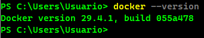
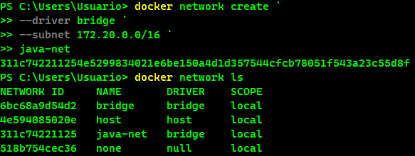
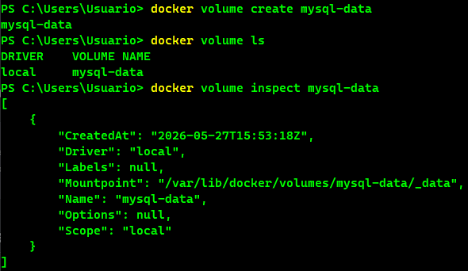
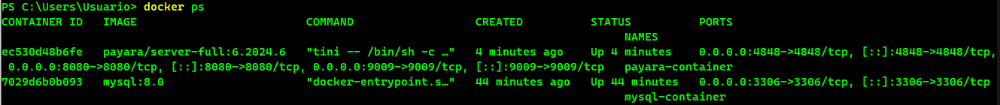
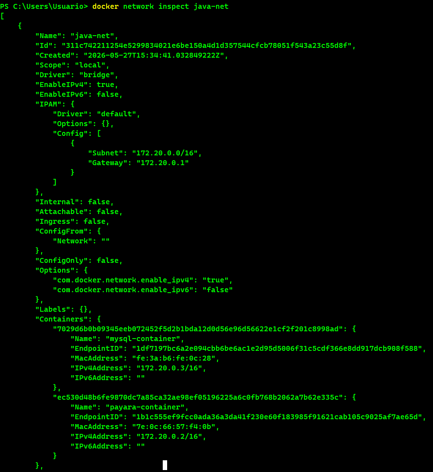
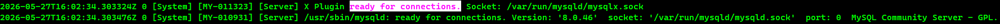

# TP Docker — MySQL + Java App Server
## Datos del alumno
- Nombre: Tiziano Larocca
## 1. ¿Qué es Docker?
Docker es una plataforma de contenedores que permite la empaquetación de aplicaciones con sus dependencias en contenedores. A diferencia de una máquina virtual, son extremadamente ligeros ya que comparten el kernel del sistema operativo anfitrión.
## 2. Volúmenes en Docker
Un volumen es un mecanismo de almacenamiento que permite guardar datos de manera persistente fuera del ciclo de vida de un contenedor. Son gestionados por Docker y existen 3 tipos principales:
- **Named Volumes:** gestionados por Docker, recomendados para bases de datos.
- **Bind Mounts:** mapeo directo de un directorio del host.
- **tmpfs Mounts:** almacenamiento en memoria RAM (no persistente).
## 3. Redes en Docker
Docker puede administrar la comunicación entre contenedores via redes virtuales. Gracias a la resolución automática de DNS de Docker los contenedores pueden comunicarse entre sí usando sus nombres como hostname. Existen 4 tipos de redes en Docker:
- **Bridge:** red privada donde los contenedores se comunican entre sí.
- **Host:** el contenedor comparte la red del host.
- **none:** el contenedor no tiene red.
- **overlay:** red multi-host para Docker Swarm.
## 4. ¿Por qué Payara Server?
Usar Payara Server es una de las mejores opciones porque ofrece una consola de administración web (GUI), soporta Jakarta EE completo: JPA, EJB, JAX-RS, CDI, JMS, etc. Contiene imágenes Docker oficiales. 
## 5. Explicación del docker-compose.yml
El archivo docker-compose.yaml es un archivo de configuración que permite ejecutar distintas aplicacione Docker de múltiples contenedores. En lugar de escribir comandos largos para cada contenedor, este archivo centraliza toda la infraestructura, redes y volúmenes.
## 6. Explicación del init.sql
El archivo init.sql es un script de inicialización para bases de datos. Contiene comandos SQL para crear la estructura inicial y los datos base cada vez que se levanta un contenedor.
## 7. Dificultades y soluciones

# Capturas de Pantalla Obligatorias

## **Parte 1 — Infraestructura Docker (5 capturas)**

## 1. Salida de docker --version y docker info en la terminal

## 2. Salida de docker network ls mostrando la red java-net

## 3. Salida de docker volume inspect mysql-data

## 4. Salida de docker ps con ambos contenedores activos

## 5. docker network inspect java-net con ambos contenedores en la red

## **Parte 2 — MySQL (3 capturas)**
## 6. Logs de MySQL mostrando: ready for connections

## 7. Salida de SHOW DATABASES; mostrando la base appdb

## 8. Salida de SELECT * FROM usuarios; con los datos del init.sql

## **Parte 3 — Payara Admin Console / GUI (5 capturas)**
## 9. Pantalla de login de Admin Console en http://localhost:4848

## 10. Dashboard principal de Payara tras iniciar sesión

## 11. Pantalla del Connection Pool MySQLPool creado

## 12. Resultado del botón Ping mostrando conexión exitosa a MySQL

## 13. JDBC Resource jdbc/MySQLDS visible en la consola

## Parte 4 — Conectividad entre contenedores (1 captura)
## 14. Salida del ping de Payara hacia mysql-container desde la terminal

