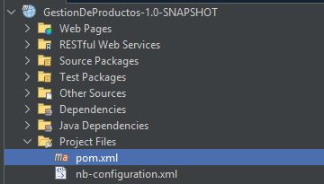
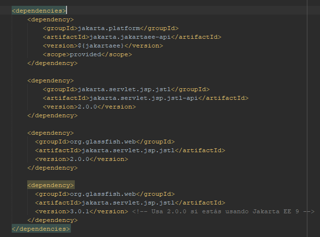
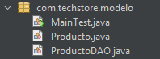
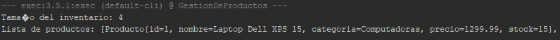
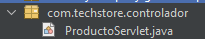
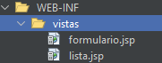
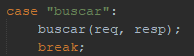
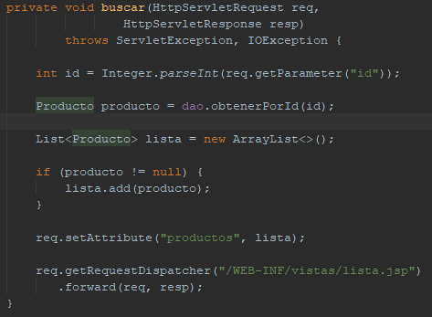
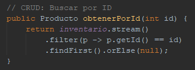

# Laboratorio Patrón MVC (Model-View-Controller)

Alumno: **Tiziano Larocca**

Profesor: **Vicente Cersósimo**

Curso: **7mo 3ra**

## Objetivo del trabajo

Implementar una aplicación web funcional aplicando el patrón de diseño `MVC` utilizando `Servlets` como controladores y `JSP` como vistas, simulando el módulo de inventario de un sistema de gestión.

## Parte 1 - Creación del proyecto y capa Modelo

Creamos el proyecto en `Maven` como web application.



Ahora añadimos las dependencias necesarias para el proyecto. Sin ellas el proyecto no podría probarse, compilarse o ejecutarse.



Creamos las clases necesarias para la lógica del proyecto. Estas están creadas dentro del paquete com.techstore.modelo. `Producto.java` representa un artículo del inventario. `ProductoDAO.java` se encarga de comunicar a la aplicación con una base de datos. Esto se simula con una lista estática. Por último, `MainTest.java` sirve para verificar que todo funciona correctamente, muestra la lista de productos y el tamaño del inventario.



### Código Producto.java

```java
package com.techstore.modelo;

public class Producto {
    private int    id;
    private String nombre;
    private String categoria;
    private double precio;
    private int    stock;
    // Constructor vacío
    public Producto() {}
    // Constructor completo
    public Producto(int id, String nombre, String categoria, double precio, int stock) {
        this.id        = id;
        this.nombre    = nombre;
        this.categoria = categoria;
        this.precio    = precio;
        this.stock     = stock;
    }
    // Getters y Setters
    public int    getId()        { return id; }
    public void   setId(int id)  { this.id = id; }
    public String getNombre()    { return nombre; }
    public void   setNombre(String nombre) { this.nombre = nombre; }
    public String getCategoria() { return categoria; }
    public void   setCategoria(String c) { this.categoria = c; }
    public double getPrecio()    { return precio; }
    public void   setPrecio(double precio) { this.precio = precio; }
    public int    getStock()     { return stock; }
    public void   setStock(int stock) { this.stock = stock; }

    @Override
    public String toString() {
        return "Producto{" + "id=" + id + ", nombre=" + nombre + ", categoria=" + categoria + ", precio=" + precio + ", stock=" + stock + '}';
    }
    
}
```

### Código ProductoDAO.java

```java
package com.techstore.modelo;
import java.util.ArrayList;
import java.util.List;
import java.util.concurrent.atomic.AtomicInteger;

public class ProductoDAO {
    // Simula una base de datos en memoria
    private static List<Producto> inventario = new ArrayList<>();
    private static AtomicInteger contadorId = new AtomicInteger(1);

    // Datos iniciales de TechStore
    static {
        inventario.add(new Producto(contadorId.getAndIncrement(),
            "Laptop Dell XPS 15", "Computadoras", 1299.99, 15));
        inventario.add(new Producto(contadorId.getAndIncrement(),
            "Mouse Logitech MX Master 3", "Periféricos", 89.99, 42));
        inventario.add(new Producto(contadorId.getAndIncrement(),
            "Monitor Samsung 27\"", "Monitores", 349.99, 8));
        inventario.add(new Producto(contadorId.getAndIncrement(),
            "Teclado Mecánico Keychron K2", "Periféricos", 119.99, 25));
    }

    // CRUD: Obtener todos los productos
    public List<Producto> obtenerTodos() {
        return new ArrayList<>(inventario);
    }

    // CRUD: Buscar por ID
    public Producto obtenerPorId(int id) {
        return inventario.stream()
            .filter(p -> p.getId() == id)
            .findFirst().orElse(null);
    }

    // CRUD: Agregar producto
    public void agregar(Producto p) {
        p.setId(contadorId.getAndIncrement());
        inventario.add(p);
    }

    // CRUD: Eliminar por ID
    public boolean eliminar(int id) {
        return inventario.removeIf(p -> p.getId() == id);
    }
}
```

### Código MainTest.java

```java
package com.techstore.modelo;

import com.techstore.modelo.ProductoDAO;

public class MainTest {
    public static void main(String[] args) {
        ProductoDAO dao = new ProductoDAO();
        
        // Imprimir el tamaño del inventario
        System.out.println("Tamaño del inventario: " + dao.obtenerTodos().size());
        
        // Imprimir el contenido de la lista
        System.out.println("Lista de productos: " + dao.obtenerTodos().toString());
    }
}
```

El código funciona correctamente.


## Preguntas de reflexión - Capa Modelo
1. ¿Por qué el DAO usa una lista estática (static)? ¿Qué implicación tiene esto en un servidor con múltiples usuarios concurrentes?
    * El DAO usa una lista estática para que todos los objetos DAO compartan los mismos datos en memoria, para simular una base de datos simple. En un servidor con múltiples usuarios implica que todos acceden y modifican la lista compartida.
  
2. ¿Qué cambios mínimos serían necesarios para que ProductoDAO se conecte a una base de datos MySQL real usando JDBC?
    * Para que ProductoDAO se conecte a una base de datos MySQL debería agregar el driver JDBC de MySQL en pom.xml, crear la conexión JDBC en ProductoDAO, reemplazar los métodos CRUD para que ejecuten consultas SQL y crear las tablas.

3. ¿Por qué se devuelve new ArrayList<>(inventario) en obtenerTodos() en lugar de devolver la referencia directamente?
    * Se devuelve new ArrayList<> en vez de devolver la referencia directamente para proteger los datos en el DAO. El código que recibe la lista podría modificar directamente el inventario, lo que rompe el principio del encapsulamiento porque cualquier clase podría alterar el estado interno del DAO.
  
## Parte 2 - Controlador Servlet

Ahora implementaremos el `Servlet`, que actúa como controlador principal de la aplicación. El Servlet interceptará todas las peticiones relacionadas con productos, llamará al `DAO` correspondiente y decidirá a qué vista redirigir. Este archivo se encontrará en otro paquete llamado `com.techstore.controlador`.



### Código ProductoServlet.java

```java
package com.techstore.controlador;


import com.techstore.modelo.Producto;
import com.techstore.modelo.ProductoDAO;
import jakarta.servlet.ServletException;
import jakarta.servlet.annotation.WebServlet;
import jakarta.servlet.http.HttpServlet;
import jakarta.servlet.http.HttpServletRequest;
import jakarta.servlet.http.HttpServletResponse;
import java.io.IOException;
import java.util.ArrayList;
import java.util.List;


// Mapeo mediante anotación (alternativa a web.xml)
@WebServlet("/productos")
public class ProductoServlet extends HttpServlet {


    private ProductoDAO dao = new ProductoDAO();


    // ── GET: mostrar lista o formulario ──────────────────────────
    @Override
    protected void doGet(HttpServletRequest req,
                         HttpServletResponse resp)
            throws ServletException, IOException {


        String accion = req.getParameter("accion");
        if (accion == null) accion = "listar";


        switch (accion) {
            case "listar":
                listar(req, resp);
                break;
            case "nuevo":
                req.getRequestDispatcher(
                    "/WEB-INF/vistas/formulario.jsp")
                   .forward(req, resp);
                break;
            case "eliminar":
                eliminar(req, resp);
                break;
            case "buscar":
                buscar(req, resp);
                break;
            default:
                listar(req, resp);
        }
    }
        // ── POST: procesar formulario ─────────────────────────────────
    @Override
    protected void doPost(HttpServletRequest req,
                          HttpServletResponse resp)
            throws ServletException, IOException {
        // Patrón PRG: Post → Redirect → Get
        req.setCharacterEncoding("UTF-8");
        String nombre    = req.getParameter("nombre");
        String categoria = req.getParameter("categoria");
        double precio    = Double.parseDouble(req.getParameter("precio"));
        int    stock     = Integer.parseInt(req.getParameter("stock"));
        Producto p = new Producto();
        p.setNombre(nombre);
        p.setCategoria(categoria);
        p.setPrecio(precio);
        p.setStock(stock);
        dao.agregar(p);
        // Redirect evita reenvío del formulario (PRG)
        resp.sendRedirect(req.getContextPath() + "/productos");
    }
    // ── Métodos privados auxiliares ───────────────────────────────
    private void listar(HttpServletRequest req,
                        HttpServletResponse resp)
            throws ServletException, IOException {
        List<Producto> lista = dao.obtenerTodos();
        req.setAttribute("productos", lista);
        req.getRequestDispatcher("/WEB-INF/vistas/lista.jsp")
           .forward(req, resp);
    }
    private void eliminar(HttpServletRequest req,
                          HttpServletResponse resp)
            throws IOException {
        int id = Integer.parseInt(req.getParameter("id"));
        dao.eliminar(id);
        resp.sendRedirect(req.getContextPath() + "/productos");
    }
    private void buscar(HttpServletRequest req,
                    HttpServletResponse resp)
            throws ServletException, IOException {

        int id = Integer.parseInt(req.getParameter("id"));

        Producto producto = dao.obtenerPorId(id);

        List<Producto> lista = new ArrayList<>();

        if (producto != null) {
            lista.add(producto);
        }

        req.setAttribute("productos", lista);

        req.getRequestDispatcher("/WEB-INF/vistas/lista.jsp")
           .forward(req, resp);
    }
}
```

Aunque se implemente el Servlet, es necesario modificar el archivo web.xml para que Tomcat sepa qué URL deba activar el Servlet.


```java
<?xml version="1.0" encoding="UTF-8"?>
<web-app xmlns="https://jakarta.ee/xml/ns/jakartaee" 
         xmlns:xsi="http://www.w3.org/2001/XMLSchema-instance"
         xsi:schemaLocation="https://jakarta.ee/xml/ns/jakartaee https://jakarta.ee/xml/ns/jakartaee/web-app_5_0.xsd"
         version="5.0">

    <!-- 1. Atributos descriptivos primero -->
    <display-name>TechStore Inventario</display-name>

    <!-- 2. Páginas de bienvenida al final -->
    <welcome-file-list>
        <welcome-file>index.jsp</welcome-file>
    </welcome-file-list>

</web-app>
```

1. Explique con sus palabras por qué se usa sendRedirect() después del doPost() en lugar de forward(). ¿Qué problema específico soluciona?
    * Se usa sendRedirect() después de doPost() en lugar de forward() para aplicar el patrón PRG (Post Redirect Get). Después de guardar el producto, el navegador recibe una redirección y realiza una nueva petición GET a  /productos. Esto soluciona la duplicación de datos. Si se usa forward() al refrescar el navegador podría reenviar el formulario POST y volver a insertar el mismo producto.

2. ¿Cuál es la diferencia entre req.setAttribute() y req.getSession().setAttribute()? ¿Cuándo usaría cada uno?
    * Con req.setAttribute() los datos sólo existen en la petición actual y se eliminan cuando termina, se usaría cuando solo se requiere mostrar una lista. En req.getSession().setAttribute() los datos permanecen durante toda la sesión del usuario, se usa para la información que debe mantenerse en solicitudes como un carrito de compras o un logueo de usuario.

3. ¿Cómo modificaría el Servlet para soportar una acción "editar" que cargue los datos de un producto en el formulario?
    * Para que el Servlet soporte una acción “editar” que cargue los datos de un producto en el formulario se debe agregar el caso “editar” en el switch de doGet() del archivo Servlet para que llame al DAO y el método. En el DAO se debe implementar el método que logre editar los datos del formulario.

## Parte 3 - Vistas: JSP y JSTL

Creamos las páginas JSP que componen la capa Vista. Las JSP utilizarán Expression Language (EL) para acceder a los atributos del request y JSTL para lógica de presentación (iteración, condicionales), sin mezclar código Java con HTML. Los archivos `lista.jsp` y `formulario.jsp` se encontrarán dentro de una carpeta `vistas`. Se implementaron con un style.



### Código lista.jsp

```java
<%@ page contentType="text/html;charset=UTF-8" language="java" %>
<%@ taglib prefix="c" uri="jakarta.tags.core" %>
<%@ taglib prefix="fmt" uri="jakarta.tags.fmt" %>
<!DOCTYPE html>
<html lang="es">
    <head>
        <meta charset="UTF-8">
        <title>TechStore — Inventario</title>
        <link rel="stylesheet" href="${pageContext.request.contextPath}/css/estilo.css">
    </head>
    <style>
        * {
            margin: 0;
            padding: 0;
            box-sizing: border-box;
        }

        body {
            font-family: "Segoe UI", Arial, sans-serif;
            background-color: #1e293b;
            color: #e2e8f0;
            min-height: 100vh;
        }

        header {
            background-color: #0f172a;
            padding: 20px;
            text-align: center;
            border-bottom: 1px solid #334155;
        }

        header h1 {
            font-size: 1.8rem;
            color: #f8fafc;
        }

        main {
            max-width: 1100px;
            margin: 30px auto;
            padding: 0 20px;
        }

        /* Barra superior */
        .acciones {
            display: flex;
            justify-content: space-between;
            align-items: center;
            margin-bottom: 20px;
        }

        .btn-nuevo {
            background-color: #2563eb;
            color: white;
            text-decoration: none;
            padding: 10px 16px;
            border-radius: 6px;
            transition: 0.2s;
        }

        .btn-nuevo:hover {
            background-color: #1d4ed8;
        }

        .form-busqueda {
            display: flex;
            gap: 10px;
        }

        .form-busqueda input {
            padding: 10px;
            border: 1px solid #475569;
            border-radius: 6px;
            background-color: #334155;
            color: white;
        }

        .form-busqueda input::placeholder {
            color: #94a3b8;
        }

        .form-busqueda button {
            padding: 10px 16px;
            border: none;
            border-radius: 6px;
            background-color: #475569;
            color: white;
            cursor: pointer;
            transition: 0.2s;
        }

        .form-busqueda button:hover {
            background-color: #64748b;
        }

        /* Tabla */
        .tabla-inventario {
            width: 100%;
            border-collapse: collapse;
            background-color: #0f172a;
            border-radius: 10px;
            overflow: hidden;
        }

        .tabla-inventario th {
            background-color: #1e293b;
            color: #f8fafc;
            padding: 14px;
            text-align: left;
        }

        .tabla-inventario td {
            padding: 14px;
            border-top: 1px solid #334155;
        }

        .tabla-inventario tr:hover {
            background-color: #1f314a;
        }

        /* Stock bajo */
        .stock-bajo {
            background-color: rgba(220, 38, 38, 0.15);
        }

        /* Botón eliminar */
        .btn-eliminar {
            background-color: #dc2626;
            color: white;
            text-decoration: none;
            padding: 7px 12px;
            border-radius: 5px;
            transition: 0.2s;
        }

        .btn-eliminar:hover {
            background-color: #b91c1c;
        }

        /* Avisos */
        .aviso {
            text-align: center;
            padding: 20px;
            background-color: #334155;
            border-radius: 8px;
            color: #cbd5e1;
        }
    </style>
    <body>
        <header>
            <h1>TechStore S.A. — Gestión de Inventario</h1>
        </header>
        <main>
            <div class="acciones">
                <a href="${pageContext.request.contextPath}/productos?accion=nuevo"
                   class="btn-nuevo">+ Agregar Producto</a>
                <form action="${pageContext.request.contextPath}/productos" method="get" class="form-busqueda">
                    <input type="hidden" name="accion" value="buscar">

                    <input type="text" name="id"
                           placeholder="Buscar por ID"
                           value="${param.buscar}">

                    <button type="submit">Buscar</button>
                </form>
            </div>

            <!-- Mensaje si el inventario está vacío -->
            <c:if test="${empty productos}">
                <p class="aviso">No hay productos registrados en el sistema.</p>
            </c:if>


            <!-- Tabla de productos -->
            <c:if test="${not empty productos}">
                <table class="tabla-inventario">
                    <thead>
                        <tr>
                            <th>ID</th><th>Nombre</th><th>Categoría</th>
                            <th>Precio</th><th>Stock</th><th>Acciones</th>
                        </tr>
                    </thead>
                    <tbody>
                        <c:forEach var="prod" items="${productos}">
                            <tr class="${prod.stock < 10 ? 'stock-bajo' : ''}">
                                <td>${prod.id}</td>
                                <td>${prod.nombre}</td>
                                <td>${prod.categoria}</td>
                                <td>$<fmt:formatNumber value="${prod.precio}"
                                                  minFractionDigits="2" maxFractionDigits="2"/></td>
                                <td>${prod.stock}</td>
                                <td>
                                    <a href="${pageContext.request.contextPath}/productos?accion=eliminar&id=${prod.id}"
                                       onclick="return confirm('¿Eliminar ${prod.nombre}?')"
                                       class="btn-eliminar">Eliminar</a>
                                </td>
                            </tr>
                        </c:forEach>
                    </tbody>
                </table>
            </c:if>
        </main>
    </body>
</html>
```

### Código formulario.jsp

```java
<%@ page contentType="text/html;charset=UTF-8" language="java" %>
<!DOCTYPE html>
<html lang="es">
<head>
  <meta charset="UTF-8">
  <title>TechStore — Nuevo Producto</title>
  <link rel="stylesheet" href="${pageContext.request.contextPath}/css/estilo.css">
</head>
<style>
    * {
        margin: 0;
        padding: 0;
        box-sizing: border-box;
    }

    body {
        font-family: "Segoe UI", Arial, sans-serif;
        background-color: #1e293b;
        color: #e2e8f0;
        min-height: 100vh;
    }

    header {
        background-color: #0f172a;
        border-bottom: 1px solid #334155;
        padding: 25px;
        text-align: center;
    }

    header h1 {
        color: #f8fafc;
        font-size: 2rem;
        font-weight: 600;
    }

    main {
        display: flex;
        justify-content: center;
        padding: 40px 20px;
    }

    .formulario {
        width: 100%;
        max-width: 650px;
        background-color: #0f172a;
        padding: 30px;
        border-radius: 12px;
        border: 1px solid #334155;
        box-shadow: 0 10px 25px rgba(0, 0, 0, 0.25);
    }

    .campo {
        display: flex;
        flex-direction: column;
        margin-bottom: 20px;
    }

    .campo label {
        margin-bottom: 8px;
        color: #cbd5e1;
        font-weight: 500;
    }

    .campo input,
    .campo select {
        width: 100%;
        padding: 12px;
        border-radius: 8px;
        border: 1px solid #475569;
        background-color: #334155;
        color: #f8fafc;
        font-size: 15px;
    }

    .campo input::placeholder {
        color: #94a3b8;
    }

    .campo input:focus,
    .campo select:focus {
        outline: none;
        border-color: #3b82f6;
        box-shadow: 0 0 5px rgba(59, 130, 246, 0.4);
    }

    .botones {
        display: flex;
        gap: 12px;
        margin-top: 30px;
    }

    .btn-guardar,
    .btn-cancelar {
        padding: 12px 18px;
        border-radius: 8px;
        text-decoration: none;
        font-size: 14px;
        cursor: pointer;
        transition: all 0.2s ease;
    }

    .btn-guardar {
        background-color: #2563eb;
        color: white;
        border: none;
    }

    .btn-guardar:hover {
        background-color: #1d4ed8;
        transform: translateY(-1px);
    }

    .btn-cancelar {
        background-color: #475569;
        color: white;
        display: inline-flex;
        align-items: center;
    }

    .btn-cancelar:hover {
        background-color: #64748b;
        transform: translateY(-1px);
    }

    @media (max-width: 600px) {

        .formulario {
            padding: 20px;
        }

        .botones {
            flex-direction: column;
        }

        .btn-guardar,
        .btn-cancelar {
            width: 100%;
            justify-content: center;
            text-align: center;
        }
    }
</style>
<body>
  <header><h1>Agregar Nuevo Producto</h1></header>
  <main>
    <form action="${pageContext.request.contextPath}/productos" method="post" class="formulario">
      <div class="campo">
        <label for="nombre">Nombre del Producto:</label>
        <input type="text" id="nombre" name="nombre" required maxlength="100" placeholder="Ej: Laptop Dell XPS">
      </div>
      <div class="campo">
        <label for="categoria">Categoría:</label>
        <select id="categoria" name="categoria" required>
          <option value="">-- Seleccionar --</option>
          <option value="Computadoras">Computadoras</option>
          <option value="Monitores">Monitores</option>
          <option value="Periféricos">Periféricos</option>
          <option value="Almacenamiento">Almacenamiento</option>
          <option value="Redes">Redes</option>
        </select>
      </div>
      <div class="campo">
        <label for="precio">Precio (USD):</label>
        <input type="number" id="precio" name="precio" step="0.01" min="0.01" required placeholder="0.00">
      </div>
      <div class="campo">
        <label for="stock">Cantidad en Stock:</label>
        <input type="number" id="stock" name="stock" min="0" required placeholder="0">
      </div>
      <div class="botones">
        <button type="submit" class="btn-guardar">Guardar Producto</button>
        <a href="${pageContext.request.contextPath}/productos" class="btn-cancelar">Cancelar</a>
      </div>
    </form>
  </main>
</body>
</html>
```

## Actividad de extensión

Implementar la funcionalidad de búsqueda por nombre o categoría: agregue un formulario de búsqueda (GET) en lista.jsp, añada un parámetro 'buscar' al Servlet y filtre la lista del DAO usando stream().filter(). La URL resultante debe ser: /productos?accion=listar&buscar=laptop.

Añadimos la opción buscar en el Servlet.





Agregamos la lógica en el DAO.



Por último, se añade el buscador y el botón en el HTML

```html
<input type="hidden" name="accion" value="buscar">

<input type="text" name="id"
    placeholder="Buscar por ID"
    value="${param.buscar}">

<button type="submit">Buscar</button>
```


