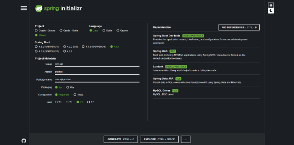

# API REST Spring Boot

Alumno: **Tiziano Larocca**

Profesor: **Vicente Cersosimo**

Curso: **7mo 3ra**

## Objetivo
Desarrollar una `API REST` funcional aplicando una arquitectura por capas. El proyecto deberá separar responsabilidades entre `Controller`, `Service`, `Repository`, `DTO` y `Entity`, utilizar `JPA` para la persistencia y
centralizar la configuración en `application.yaml`.

## Cuestionario

1. ¿Qué responsabilidad tiene cada capa?
   -  **Controller:** Toma la petición HTTP `(GET, POST, PUT, DELETE)` e invoca a la lógica necesaria según sea.
   -  **DTO:** Decide que datos entran y salen de la API sin exponerla. Por ejemplo id, datos de cuenta bancaria, etc. Como adicional se encarga de las validaciones, controlando que un objeto cumpla con determinadas 		restricciones.
   -  **Entity:** No solo funciona como clase para crear productos, mapea los atributos a la base de datos para crear la tabla products de db_product.
   -  **Repository:** Se encarga del acceso a la base de datos con métodos como `findAll()`, `findById(id)`, `save`, etc.
   -  **Service:** Es la lógica de la aplicación. Puede modificar entidades, borrarlas, crear, etc.
2. ¿Por qué no es recomendable devolver directamente una Entity desde el Controller?
   - Porque podrían exponerse datos internos que no deberían ser vistos. Además, la API no queda atada a la estructura de la base de datos.
3. ¿Cuál es la diferencia entre Entity y DTO?
   - Entity mapea sus atributos a la base de datos para crear la tabla products. DTO controla qué datos entran y salen de la base de datos sin exponer datos sensibles.
4. ¿Qué función cumple JpaRepository?
   - `JpaRepository` facilita las consultas a la base de datos sin escribir las consultas SQL comunes. Se usan métodos como findAll(), deleteById(), save(), etc.
5. ¿Qué ocurre cuando el Service necesita consultar un registro que no existe?
   - Cuando el Service consulta un registro que no existe lanza un `EntityNotFoundException` para que el controlador luego responda con un `HTTP 404 Not found`.
6. ¿Qué ventajas ofrece application.yaml?  
   - `application.yaml` permite configurar la aplicación de forma ordenada, por ejemplo, la conexión a la base de datos, el puerto del servidor o configuraciones de JPA. Facilita cambiar configuraciones sin                       modificar el código.
7. ¿Por qué una API debería devolver diferentes códigos HTTP según el resultado de la operación?
   - Porque los códigos HTTP indican al cliente qué ocurrió con la solicitud. Por ejemplo:
        - `GET 200 OK:` los datos fueron obtenidos correctamente.
        - `POST 201 Created:` se creó un nuevo recurso.
        - `PUT 200 OK:` el recurso fue actualizado correctamente.
        - `DELETE 204 No Content:` el recurso fue eliminado correctamente.

### Construcción de la API

1. Generamos el proyecto con las dependencias necesarias y lo descomprimimos.


2. Creamos la DB con `MySQL`.
```MySQL
CREATE DATABASE db_product;
```

3. Configuramos el archivo `application.properties`, donde indicamos las configuraciones de la base de datos de la aplicación.
```properties
spring.application.name=api-product
#DATABASE
spring.jpa.hibernate.ddl-auto=update
spring.datasource.url=jdbc:mysql://localhost:3306/db_product
spring.datasource.username=root
spring.datasource.password=
spring.datasource.driver-class-name=com.mysql.cj.jdbc.Driver
spring.jpa.show-sql= true
```
4. Creamos los paquetes necesarios para que funcione la API: `controller`, `dto`, `entity`, `repository` y `service`. Cada uno tiene un rol distinto que se irá explicando conforme se implementen.
5. Implementamos la clase `Product`, la cual representan los datos que se guardan en la base de datos. Es como si "mapeara" sus atributos a la DB para crear la tabla products.
```java
package com.api.product.entity;

import jakarta.persistence.*;
import lombok.AllArgsConstructor;
import lombok.Data;
import lombok.NoArgsConstructor;

@NoArgsConstructor // Lombok annotation to generate a no-args constructor
@AllArgsConstructor // Lombok annotation to generate an all-args constructor
@Data //Lombok annotation to generate setter and getter
@Entity //JPA annotation to specify entity
@Table(name = "products") // JPA annotation to specify the table name for this entity
public class Product {
    //--------------------------------
    @Id //JPA annotation to specify primary key
    @GeneratedValue(strategy = GenerationType.IDENTITY) //JPA annotation to specify auto-increment
    private Long id; //this attribute is primary key and auto_increment
    //-----------------------------------
    private String name;
    private float price;
    private int quantity;
}
```

6. Se crea la interfaz `ProductRepository`. Esta se encargará del acceso a la base de datos mediante los métodos CRUD.
```java
package com.api.product.repository;

import com.api.product.dto.ProductDTO;
import com.api.product.entity.Product;
import org.springframework.data.jpa.repository.JpaRepository;
import org.springframework.data.repository.CrudRepository;
import org.springframework.stereotype.Repository;

@Repository
public interface ProductRepository extends JpaRepository<Product,Long> {

}
```

7. En la capa service creamos una interfaz `ProductService` con los métodos y otra clase `ProductServiceImpl` que implemente los métodos definidos en la interfaz. Se implementan los métodos CRUD definidos en el framework JPA.

**ProductService**
```java
package com.api.product.service;

import com.api.product.dto.ProductDTO;
import com.api.product.entity.Product;
import java.util.List;

public interface ProductService {
    //create
    public Product createProduct(ProductDTO productDTO);

    //read
    List<Product> getAllProducts();
    public Product getProductById(Long productId);

    //update
    public Product updateProduct(Long productId, ProductDTO productDTO);

    //delete
    public Product deleteProductById(Long productId);

}
```

**ProductServiceImpl**
```java
package com.api.product.service;

import jakarta.persistence.EntityNotFoundException;
import com.api.product.dto.ProductDTO;
import com.api.product.entity.Product;
import com.api.product.repository.ProductRepository;
import org.springframework.beans.factory.annotation.Autowired;
import org.springframework.stereotype.Service;

import java.util.List;
import java.util.Optional;

@Service
public class ProductServiceImpl implements ProductService {

    @Autowired
    private ProductRepository productRepository;

    @Override
    public Product createProduct(ProductDTO productDTO) {
        Product product = new Product();
        product.setName(productDTO.name());
        product.setPrice(productDTO.price());
        product.setQuantity(productDTO.quantity());
        return productRepository.save(product);
    }

    @Override
    public List<Product> getAllProducts() {
        return productRepository.findAll();
    }

    @Override
    public Product getProductById(Long productId) {
        return productRepository.findById(productId)
                .orElseThrow(() -> new EntityNotFoundException("Product not found with id " + productId));
    }

    @Override
    public Product updateProduct(Long productId, ProductDTO productDTO) {
        Optional<Product> optionalProduct = productRepository.findById(productId);
        if (optionalProduct.isPresent()) {
            Product existingProduct = optionalProduct.get();
            existingProduct.setName(productDTO.name());
            existingProduct.setPrice(productDTO.price());
            existingProduct.setQuantity(productDTO.quantity());
            return productRepository.save(existingProduct);
        }
        return null;
    }

     @Override
    public Product deleteProductById(Long productId) {
        Optional<Product> optionalProduct = productRepository.findById(productId);
        if (optionalProduct.isPresent()) {
            productRepository.deleteById(productId);
            return optionalProduct.get();
        }
        return null;
    }
}
```

8. Creamos `ProductController`, el cual manejara las peticiones HTTP y enviará las respuestas necesarias. Invoca la lógica necesaria según la petición. También se encarga de manejar los `endpoint`.
```java
package com.api.product.controller;

import jakarta.persistence.EntityNotFoundException;
import com.api.product.entity.Product;
import com.api.product.service.ProductService;
import com.api.product.dto.ProductDTO;
import org.springframework.beans.factory.annotation.Autowired;
import org.springframework.http.HttpStatus;
import org.springframework.http.ResponseEntity;
import org.springframework.web.bind.annotation.*;

import java.util.List;
import jakarta.validation.Valid;

@RestController
@RequestMapping("/api/v1")
@CrossOrigin("*")
public class ProductController {

    //inject dependency
    @Autowired
    private ProductService productService;

    @PostMapping("/products")
    //method to save product
    public ResponseEntity<Product> saveProduct(@Valid @RequestBody ProductDTO productDTO) {
        System.out.println(productDTO);
        return ResponseEntity.status(HttpStatus.CREATED).body(productService.createProduct(productDTO));
    }

    @GetMapping("/products")
    //method to get all products
    public ResponseEntity<List<Product>> getAllProducts() {
        return ResponseEntity.ok(productService.getAllProducts());
    }

    @GetMapping("/products/{id}")
    //method to get product by id
    public ResponseEntity<Product> getProductById(@PathVariable Long id) {
        return ResponseEntity.ok(productService.getProductById(id));
    }

    @PutMapping("/products/{id}")
    //method to update product
    public ResponseEntity<Product> updateProduct(@PathVariable Long id, @Valid @RequestBody ProductDTO productDTO) {
        System.out.println(id);
        System.out.println(productDTO);
        Product existingProduct = productService.getProductById(id);
        if (existingProduct == null) {
            throw new EntityNotFoundException("Product not found with id: " + id);
        }
        return ResponseEntity.ok(productService.updateProduct(id, productDTO));
    }

    @DeleteMapping("/products/{id}")
    //method to delete product
    public ResponseEntity<String> deleteProduct(@PathVariable Long id) {
        productService.deleteProductById(id);
        return ResponseEntity.ok("Product deleted successfully");
    }

    @ExceptionHandler(EntityNotFoundException.class)
    public ResponseEntity<String> handleEntityNotFoundException(EntityNotFoundException ex) {
        return ResponseEntity.status(HttpStatus.NOT_FOUND).body(ex.getMessage());
    }
}
```

9. Por último creamos la clase `ProductDTO`, la cuál tendrá 2 funciones: Definir que datos entran o salen de la API como por ejemplo, que entre un producto con id, nombre, precio y cantidad. Cuando se pida leerlo que solo se vea el nombre, precio y cantidad. También tendrá la función de las validaciones, las cuales verifican que un producto se cree con determinadas restricciones. Por ejemplo que el nombre tenga más de un caracter.
```java
package com.api.product.dto;

import jakarta.validation.constraints.*;

public record ProductDTO(
        @NotBlank(message = "Name is required")
        @Size(min = 2, max = 50, message = "Name must be between 2 and 50 characters")
        String name, 
        
        @NotNull(message = "Price must be higher than 0")
        @Positive
        float price, 
        
        @Min(0)
        @Positive
        int quantity) {

}
```
