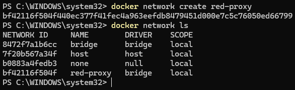
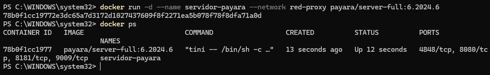
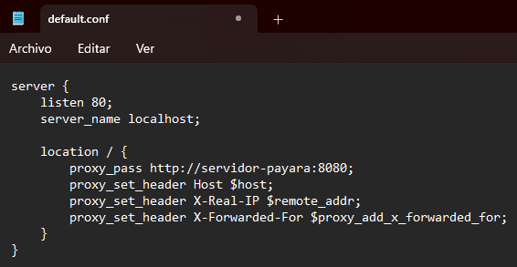
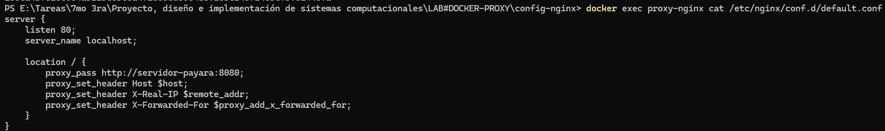
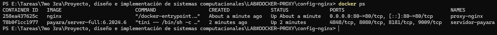
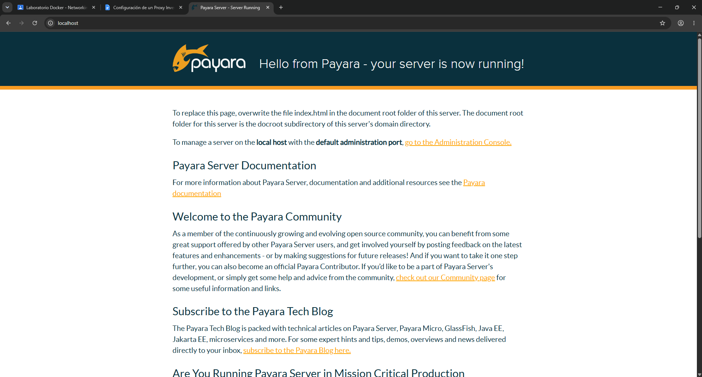

# Laboratorio Docker - Networking - Reverse Proxy
Alumno: **Tiziano Larocca**

Profesor: **Vicente Cersosimo**

Curso: **7mo 3ra**

## Objetivo del trabajo
Configurar un servidor web `Nginx` que actúe como `proxy inverso` para redirigir el tráfico desde tu host hacia un contenedor de aplicaciones `Payara Server` que se ejecuta de forma aislada.

### Paso 1: Crear la Red Virtual de Docker
Para que el proxy inverso se comunique con Payara, ambos contenedores deben compartir una red interna. En una terminal, creamos la y verificamos la red creada.

```
docker network create red-proxy
```



### Paso 2: Desplegar el Contenedor Payara (Backend)
Desplegamos el servidor Payara en la red interna. No se expondrán sus puertos directamente al host local, simulando un entorno de producción seguro. En la terminal ejecutamos el siguiente comando para la creación y verificamos.

```
docker run -d --name servidor-payara --network red-proxy payara/server-full:6.2024.6
```


### Paso 3: Configurar el Proxy Inverso (Nginx)
Crearemos un archivo de configuración para indicarle a Nginx que todo el tráfico que reciba en el puerto 80 debe redirigirlo al puerto 8080 del contenedor de Payara. Para hacerlo creamos una carpeta llamada `config-nginx` y dentro de ella el archivo `default.conf` con la siguiente configuración:

```
server {
    listen 80;
    server_name localhost;

    location / {
        proxy_pass http://servidor-payara:8080;
        proxy_set_header Host $host;
        proxy_set_header X-Real-IP $remote_addr;
        proxy_set_header X-Forwarded-For $proxy_add_x_forwarded_for;
    }
}
```



### Paso 4: Desplegar el Contenedor Nginx 
Ahora se asociará el archivo de configuración creado con un nuevo contenedor de Nginx. Este contenedor sí estará expuesto al host. Deberemos tener una terminal en la ruta donde creamos el archivo default.conf y ejecutar el siguiente comando:

```
docker run -d --name proxy-nginx --network red-proxy -p 80:80 -v "$(pwd)/default.conf:/etc/nginx/conf.d/default.conf" nginx
```

-v "$(pwd)/default.conf:/etc/nginx/conf.d/default.conf": Monta un volumen. Toma el archivo default.conf de tu directorio actual ($(pwd)) y lo duplica/reemplaza dentro del contenedor en la ruta de configuración de Nginx. Cualquier cambio que hagas en tu archivo local se aplicará en el contenedor. 

Verificamos default.conf en el contenedor.



Ambos contenedores están activos.



### Paso 5: Verificación desde el Cliente (Host Local)
El cliente (tu navegador web) hará una petición directamente a `http://localhost`. Nginx recibirá la petición y te mostrará la interfaz de Payara de manera transparente. En el navegador web escribimos http://localhost y vemos la interfaz de Payara.


