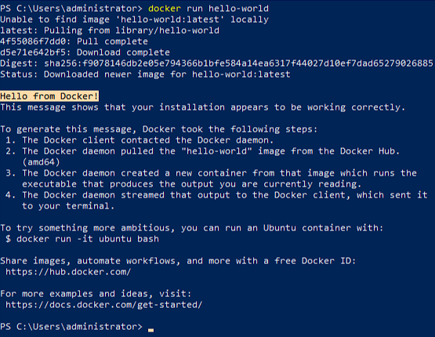
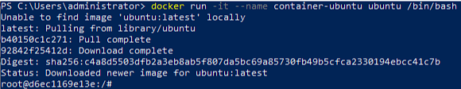
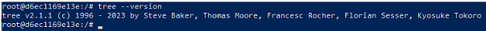
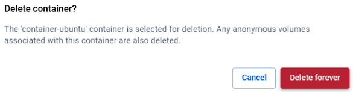
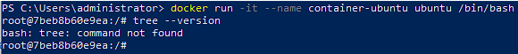
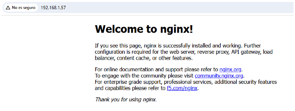
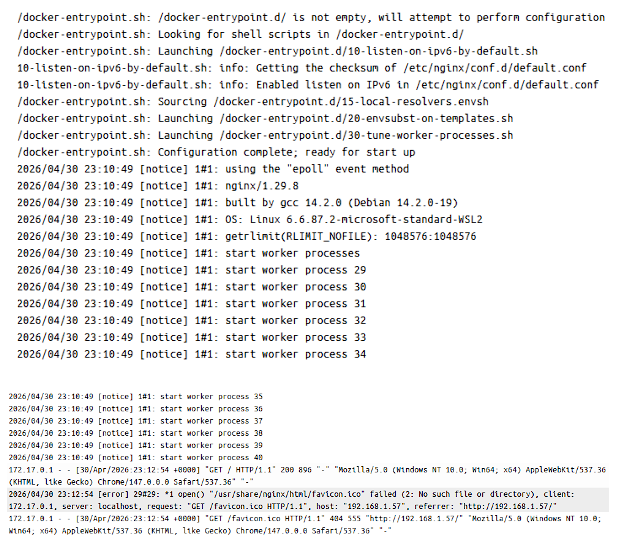
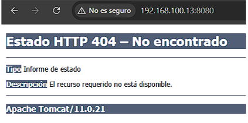
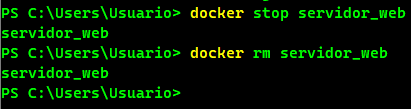

# Laboratorio Docker

## Ejercicios para repasar
1. Ejecuta un contenedor a partir de la imagen **hello-word** . Comprobar  que funcione observando la salida del contenedor. Borra el contenedor.
    - Por powershell ejecutamos un contenedor con la imágen hello-world
      
    

2. Crea un contenedor interactivo desde una imagen Ubuntu. Instala un paquete (por ejemplo tree). Sali de la terminal, ¿sigue el contenedor corriendo? ¿Por qué?. volvé a iniciar el contenedor y accede de nuevo a él de forma interactiva. ¿Sigue instalado el tree?. Salí del contenedor, y bórralo. Crea un nuevo contenedor interactivo desde la misma imagen. ¿Tiene el tree instalado?
    - Con `docker run -it --name container-ubuntu ubuntu /bin/bash` creamos el contenedor con la imágen ubuntu.
   
    

    - Antes de instalar `tree` hacemos:

    ```
    apt-get update
    apt-get upgrade
    ```
    Luego instalamos tree con `apt install tree`. Salimos de la terminal y el contenedor se detiene. El contenedor para porque el proceso que iniciamos (bin/bash) termina cuando cerramos sesión. En docker, si el proceso principal finaliza el contenedor se apaga.

   

   - Nos conectamos de nuevo al contenedor. Tree sigue instalado.
   
   

   Salimos del contenedor y lo eliminamos.

   

   - Creamos de nuevo el contenedor, tree no está instalado.
     
   

3. Crea un contenedor con un servidor nginx, usando la imagen oficial de nginx. Al crear el contenedor. Accede al navegador web y comprobar que el servidor está funcionando. Mostrar los logs del contenedor.

    - Creamos el contenedor nginx con `docker run --name container-nginx -p80:80 -d nginx`. El contenedor funciona.

    

    Logs del servidor.

    

## Ejercicio para entregar

Crearemos un contenedor con  la imagen de `tomcat`, el contenedor se debe llamar `servidor_web` y se debe acceder a él utilizando el puerto 8080 del localhost

**Entregar un link a un  documento .md en github** con las siguientes capturas de pantalla:

- Creación del contenedor y comprobación que el contenedor está funcionando.
- Acceso al servidor web utilizando un navegador web
- Eliminar el contenedor.

    - Creamos el servidor tomcat con `docker run -d --name servidor_web -p 8080:8080 tomcat`, la imágen se descarga automáticamente. El contenedor se llama servidor_web y se usa el puerto 8080. No aparece una interfaz web porque no hay una aplicación por defecto subida.
 
        

    - Paramos y borramos el contenedor.

        
  
