# Proyecto: Desplegar una Aplicación Web en Docker con Tomcat

## Paso 1
Descargamos la aplicación web Jenkins para poder desplegarla en tomcat.

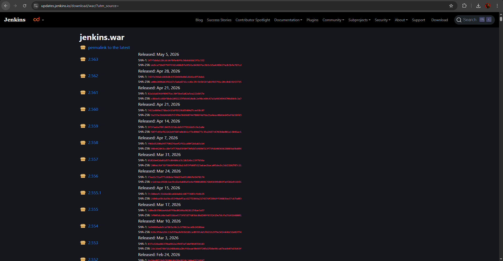

Además, nos ponemos con wsl por powershell. Sin wsl no funciona docker.

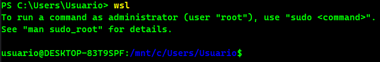

## Paso 2

Hacemos toda la estructura de directorios.

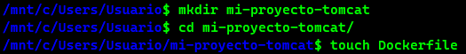

Intentamos copiar la aplicación .war en el directorio del proyecto, pero no podemos.

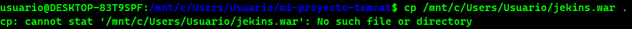
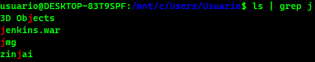

Por ello decidimos descargar la aplicación directamente en el directorio.

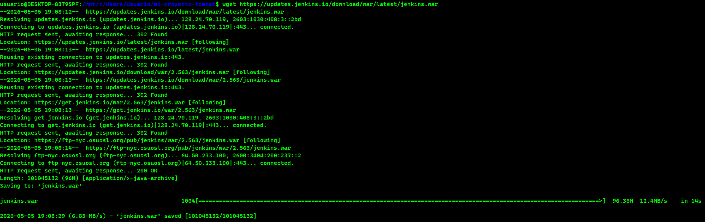
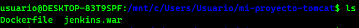

## Paso 3

Previo a modificar el archivo Dockerfile para la imágen, verificamos la imágen de tomcat que tenemos.

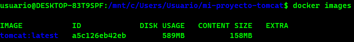

Una vez verificamos, modificamos el archivo con la versión correspondiente.

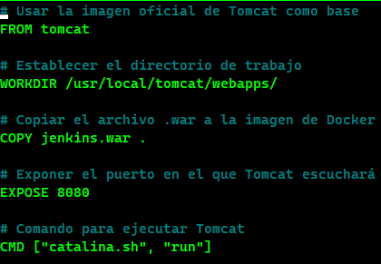

## Paso 4

Construimos la imágen de Docker y ejecutamos el contenedor creado.

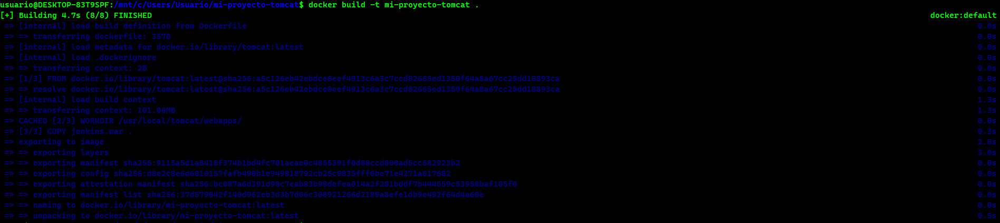
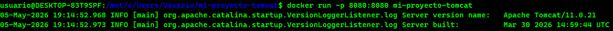

## Paso 5

Una vez este ejecutado, verificamos que la aplicación web funcione.

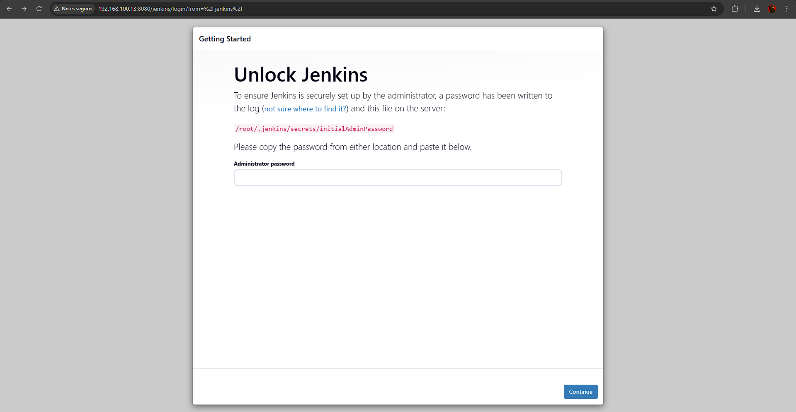

Funciona 😃
